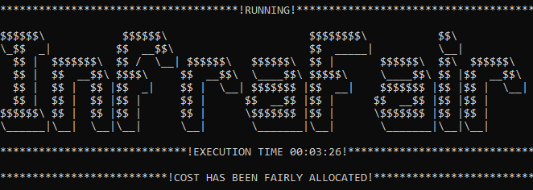

# InfraFair
*"Fairness in allocating infrastructure cost"*   

**InfraFair** has been developed at the [Instituto de Investigación Tecnológica (IIT)](https://www.iit.comillas.edu/index.php.en) 
of the [Universidad Pontificia Comillas](https://www.comillas.edu/en/).

- 📖 [**Full Documentation**](https://infrafair.readthedocs.io/en/latest/index.html)
- 💻 [**Project GitHub**](https://github.com/IIT-EnergySystemModels/InfraFair/tree/main)
- 🐍 Language: Python 3

---

## 🧠 Model Overview

The InfraFair is a modelling tool aimed at computing the allocation of the cost of energy infrastructure according 
to the economic use expected to be made by agents, driving efficient investment decisions. 
InfraFair determines the network utilisation of agents, system operators and countries. 
Based on this utilisation and assuming that it reflects the economic benefits received by agents, 
it determines the responsibility of each agent in the construction of each element in the network. 
Additionally, it can also attribute losses on the assets to their responsible agents.

---

## 📚 Training Material

- 🛠️ [**Installation Guide (PDF)**](Guide_for_installing_Python_and_InfraFair.pdf)

- 🧾 [**Summary Presentation**](InfraFair_Introduction.pdf)

- ❓ [**Q&A Summary**](InfraFair_Q&A.pdf)

---

## ⚙️ Installation

InfraFair can be easily installed with pip:

      > pip install InfraFair 

Alternatively, it can be installed from its GitHub repository following these four steps:

1. Clone the InfraFair repository, which includes the folder structure and all necessary functions to run the model.
2. Launch the command prompt (Windows: Win+R, type "cmd", Enter) or the Anaconda prompt.
3. Set up the path to where the repository was cloned, using the command 
      
         > cd "C:\Users\<username>\...\InfraFair".
4. Install InfraFair via pip by using the command 
      
         > pip install . 

An already installed model can be upgraded to the latest version with the following command:

      > pip install --upgrade InfraFair 

---

## 🚀 How to Run InfraFair

Once installation is complete, InfraFair can be 
executed by using a command prompt. In the directory of your choice, open and execute the InfraFair.py script by using 
the following on the command prompt (Windows) or Terminal (Linux) (Depending on what your standard python version is, 
you might need to call python3 instead of python)::

    > python InfraFair.py

Then, three parameters (directory folder, and configuration file) will be asked for.

**Remark**: at this step, only press enter for each input and InfraFair will be executed with the default parameters.

After this, in a directory of your choice, make a copy of the [Simple example](<https://github.com/IIT-EnergySystemModels/InfraFair/tree/main/Examples/Simple_ex>) or [EU example](<https://github.com/IIT-EnergySystemModels/InfraFair/tree/main/Examples/EU_ex>) case to create a new 
case of your choice but using the current format of the .csv files.
Proper execution of InfraFair.py can be made by introducing the new case and the directory of your choice. 

Then, the output results should be written in the same folder as the case input. 

**Note**: An alternative way to run the model is by creating a new script **script.py**, and writing the following:
        
    from InfraFair import InfraFair_run
        
    InfraFair_run(<dir>, <case>, <config_file>)

Once the model finishes, you will see the image below.

---

## 🎥 Step-by-step Video Support

Installing InfraFair tutorial on 

Running InfraFair tutorial on 

---

## 📄 Scientific Publication

📘 Mohamed A. Eltahir Elabbas, Luis Olmos Camacho, Ignacio Pérez-Arriaga, InfraFair: Infrastructure cost allocation, 2025, SoftwareX, Vol. 29, pp. 102069-1 - 102069-9, DOI:10.1016/j.softx.2025.102069. [Link](2025_InfraFair_journal_paper.pdf)

---

### ❓ Need Help?

Check our [Questions & Answers](InfraFair_Q&A.pdf) page for common issues and guidance.

For **bugs and feature requests**, please use the `issue tracker <https://github.com/IIT-EnergySystemModels/InfraFair/issues>`_.

Get in touch [@MohElabbas](mohamed.a.eltahir@hotmail.com) 

---

## 📜 License

Copyright 2023 [Universidad Pontificia Comillas](https://www.comillas.edu/en/).

InfraFair is licensed under the open source [AGPL-3.0 license](https://github.com/IIT-EnergySystemModels/InfraFair/tree/main/LICENSE).
