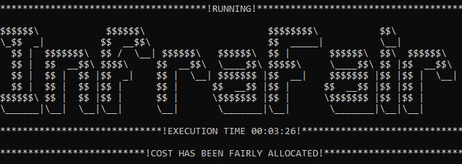

# InfraFair
*"Équité dans la répartition des coûts d'infrastructure"*   

**InfraFair** a été développé à l’[Instituto de Investigación Tecnológica (IIT)](https://www.iit.comillas.edu/index.php.en) 
de l’[Universidad Pontificia Comillas](https://www.comillas.edu/en/).

- 📖 [**Documentation complète**](https://infrafair.readthedocs.io/en/latest/index.html)
- 💻 [**Projet GitHub**](https://github.com/IIT-EnergySystemModels/InfraFair/tree/main)
- 🐍 Langage : Python 3

---

## 🧠 Présentation du modèle

InfraFair est un outil de modélisation destiné à calculer la répartition des coûts des infrastructures énergétiques en fonction de l’usage économique attendu des agents, favorisant ainsi des décisions d’investissement efficaces.  
InfraFair détermine l’utilisation du réseau par les agents, les opérateurs de système et les pays.  
Sur la base de cette utilisation, et en supposant qu’elle reflète les bénéfices économiques reçus, il attribue à chaque agent une responsabilité dans la construction de chaque élément du réseau.  
De plus, il peut également attribuer les pertes sur les actifs aux agents responsables.

---

## 📚 Matériel de formation

- 🛠️ [**Guide d'installation (PDF)**](Guide_for_installing_Python_and_InfraFair.pdf)
- 🧾 [**Présentation résumée**](InfraFair_Introduction.pdf)
- ❓ [**Résumé des questions-réponses**](InfraFair_Q&A.pdf)

---

## ⚙️ Installation

InfraFair peut être facilement installé avec pip :

```
> pip install InfraFair
```

Alternativement, il peut être installé depuis le dépôt GitHub en suivant les quatre étapes suivantes :

1. Cloner le dépôt InfraFair, qui inclut la structure des dossiers et toutes les fonctions nécessaires à l’exécution du modèle.
2. Lancer l’invite de commande (Windows : Win+R, taper "cmd", Entrée) ou l’invite Anaconda.
3. Se placer dans le répertoire où le dépôt a été cloné avec la commande :

```
> cd "C:\Users\<nom_utilisateur>\...\InfraFair"
```

4. Installer InfraFair via pip avec la commande :

```
> pip install .
```

Un modèle déjà installé peut être mis à jour à la dernière version avec la commande suivante :

```
> pip install --upgrade InfraFair
```

---

## 🚀 Exécution d’InfraFair

Une fois l’installation terminée, InfraFair peut être exécuté via l’invite de commande.  
Dans le répertoire de votre choix, ouvrez et exécutez le script `InfraFair.py` avec la commande suivante (Windows ou Terminal Linux). Selon votre système, vous devrez peut-être utiliser `python3` à la place de `python` :

```
> python InfraFair.py
```

Trois paramètres vous seront alors demandés (répertoire, nom du cas et fichier de configuration).

**Remarque** : à cette étape, il suffit d’appuyer sur Entrée à chaque invite pour exécuter InfraFair avec les paramètres par défaut.

Ensuite, dans un répertoire de votre choix, copiez l’exemple [Simple](https://github.com/IIT-EnergySystemModels/InfraFair/tree/main/Examples/Simple_ex) ou [EU](https://github.com/IIT-EnergySystemModels/InfraFair/tree/main/Examples/EU_ex) pour créer votre propre cas en utilisant le format actuel des fichiers `.csv`.  
Une exécution correcte de `InfraFair.py` nécessite d’introduire le nouveau cas et le répertoire correspondant.  

Les résultats de sortie seront ensuite écrits dans le même dossier que les fichiers d’entrée du cas.

**Note** : Une autre manière d’exécuter le modèle consiste à créer un nouveau script Python `script.py` et à écrire :

```python
from InfraFair import InfraFair_run

InfraFair_run(<dossier>, <cas>, <fichier_config>)
```

Une fois l’exécution terminée, vous verrez l’image ci-dessous :



---

## 🎥 Tutoriels vidéo étape par étape

Tutoriel pour l'installation d'InfraFair sur  
<a href="https://www.youtube.com/watch?v=eLM3E8ascss" target="_blank" style="text-decoration: none;">
  
</a>

Tutoriel pour l'exécution d'InfraFair sur  
<a href="https://www.youtube.com/watch?v=13mpD6cmZxc&t=5s" target="_blank" style="text-decoration: none;">
  
</a>

---

## 📄 Publication scientifique

📘 Mohamed A. Eltahir Elabbas, Luis Olmos Camacho, Ignacio Pérez-Arriaga, *InfraFair: Infrastructure cost allocation*, 2025, *SoftwareX*, Vol. 29, pp. 102069-1 - 102069-9, DOI:10.1016/j.softx.2025.102069. [Lien](2025_InfraFair_journal_paper.pdf)

---

### ❓ Besoin d’aide ?

Consultez notre page [Questions & Réponses](InfraFair_Q&A.pdf) pour les problèmes courants et les conseils.

Pour les **bugs et suggestions**, utilisez le [gestionnaire d’incidents GitHub](https://github.com/IIT-EnergySystemModels/InfraFair/issues).

Contactez-nous : [@MohElabbas](mailto:mohamed.a.eltahir@hotmail.com)

---

## 📜 Licence

Copyright 2023 [Universidad Pontificia Comillas](https://www.comillas.edu/en/).

InfraFair est sous licence libre [AGPL-3.0](https://github.com/IIT-EnergySystemModels/InfraFair/tree/main/LICENSE).

